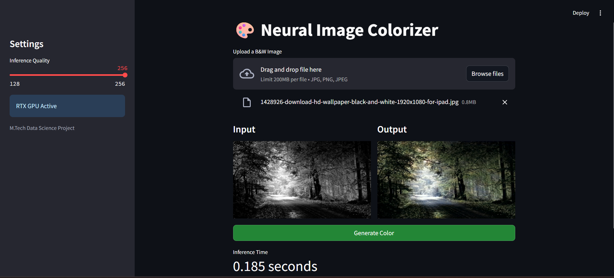

# 🎨 NeuralColorizer

**M.Tech Data Science Mini-Project | Rajiv Gandhi Institute of Technology (RIT), Kottayam**

A deep learning application that automatically restores realistic colors to grayscale landscape photographs. Built with a custom CNN architecture featuring a **Self-Attention bottleneck**, the model operates in the CIE LAB color space to predict perceptually accurate colors while preserving the original luminance channel.

---

## ✨ Features

- **Attention-Driven Colorization** — A Self-Attention mechanism in the bottleneck captures long-range spatial context, helping the model distinguish sky, water, foliage, and terrain without "color bleeding."
- **LAB Color Space Pipeline** — The luminance channel (*L*) is preserved as-is; only the *ab* (chrominance) channels are predicted, giving structurally faithful results.
- **Skip Connections** — Encoder feature maps are added back during decoding for sharper spatial reconstruction.
- **Interactive Streamlit UI** — Upload an image, choose inference resolution, and get side-by-side before/after results in a browser.
- **GPU Accelerated** — Automatically uses CUDA if available; falls back to CPU otherwise.

---

## 🧠 Model Architecture

The `Colorizer` network (`model.py`) follows an encoder-decoder design:

```
Input (L channel, 1×H×W)
       │
   [Encoder]
   Conv 1→64   (stride 2)  + BatchNorm + ReLU
   Conv 64→128 (stride 2)  + BatchNorm + ReLU
       │
   [Bottleneck]
   Conv 128→256 (stride 2) + ReLU + SelfAttention(256)
       │
   [Decoder]
   ConvTranspose 256→128   + skip from enc2
   ConvTranspose 128→64    + skip from enc1
   ConvTranspose 64→2      + Tanh  →  predicted ab channels
       │
Output (ab channels, 2×H×W) → reconstructed RGB image
```

The `SelfAttention` module computes query, key, and value projections, applies a softmax attention map, and blends the attended output with the identity via a learnable `gamma` scalar.

---

## 📦 Installation

**Requirements:** Python 3.10+

```bash
# 1. Clone the repository
git clone https://github.com/Swathi014/NeuralColorizer.git
cd NeuralColorizer

# 2. (Recommended) Create and activate a virtual environment
python -m venv venv
source venv/bin/activate        # macOS/Linux
venv\Scripts\activate           # Windows

# 3. Install dependencies
pip install -r requirements.txt
```

**Core dependencies:**

| Package | Purpose |
|---|---|
| `torch` | Model inference |
| `streamlit` | Web UI |
| `Pillow` | Image I/O |
| `scikit-image` | LAB ↔ RGB conversion |
| `numpy` | Array operations |

---

## ▶️ Running the App

Place the trained weights file `landscape_model.pth` in the project root, then launch:

```bash
streamlit run app.py
```

Open the URL shown in your terminal (usually `http://localhost:8501`).

1. Use the **Inference Quality** slider in the sidebar to select processing resolution — `128` (faster) or `256` (higher detail).
2. Upload a grayscale (or desaturated) landscape image (JPG/PNG).
3. Click **Generate Color**.
4. The colorized output is displayed alongside the original, and inference time is shown below.

> **Note:** `landscape_model.pth` is excluded from version control (see `.gitignore`). Download or provide the weights separately before running.

---

## 🗂️ Project Structure

```
NeuralColorizer/
├── app.py                  # Streamlit frontend & inference pipeline
├── model.py                # PyTorch model (Colorizer + SelfAttention)
├── landscape_model.pth     # Trained weights (not in repo — add locally)
├── requirements.txt        # Python dependencies
└── .gitignore
```

---

## 📊 Training Details

| Setting | Value |
|---|---|
| Dataset | Landscape Colorization Dataset (Kaggle) |
| Epochs | 100+ |
| Optimizer | Adam |
| Loss | Mean Squared Error (MSE) on *ab* channels |
| Inference resolution | 128×128 or 256×256 (resized back to original for output) |

---

## 🎓 Academic Info

| | |
|---|---|
| **Author** | Swathi P. |
| **Program** | M.Tech Data Science |
| **Institution** | Rajiv Gandhi Institute of Technology (RIT), Kottayam |
| **Year** | 2026 |

---

## 🖼️ Demo

> Add a `demo.png` screenshot of a before/after comparison and uncomment the line below:

  
